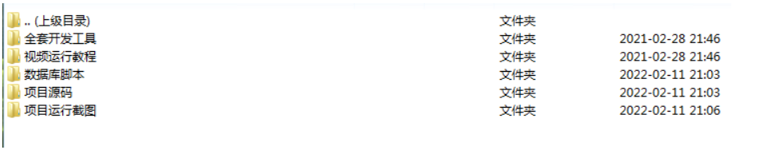
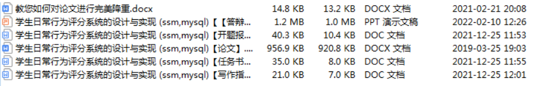
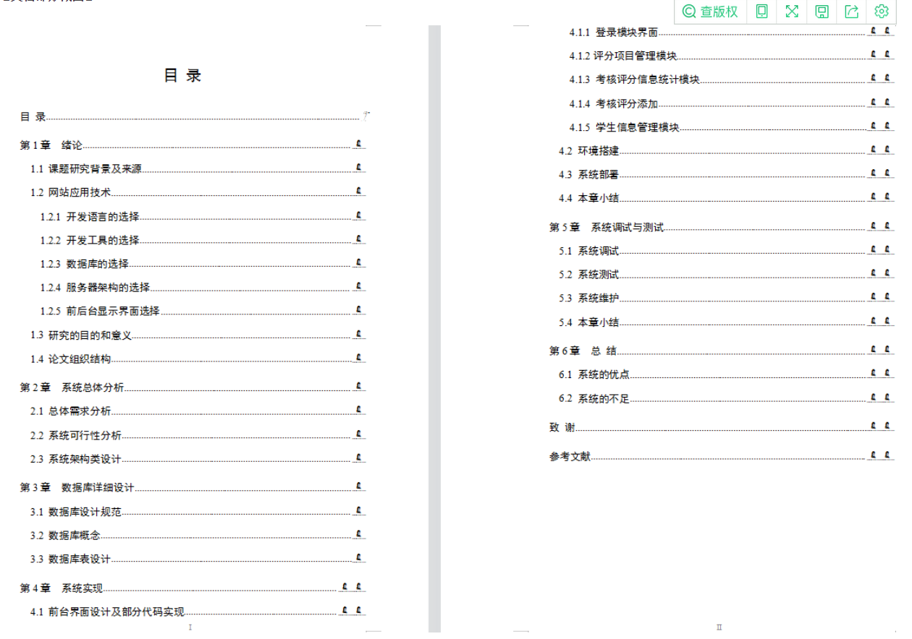
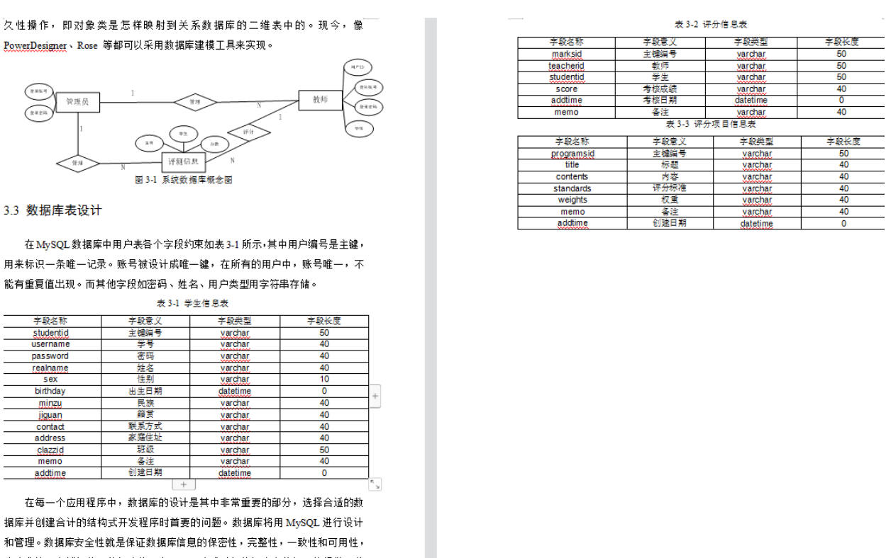
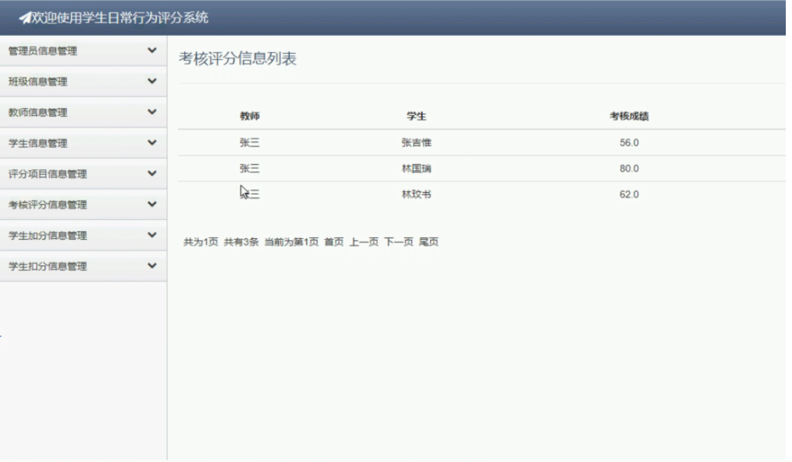
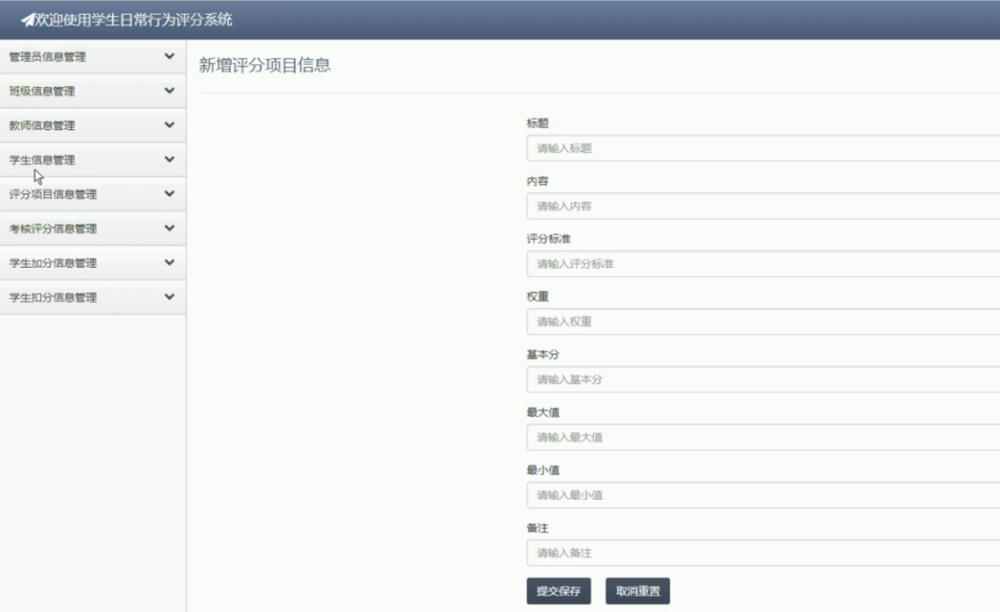
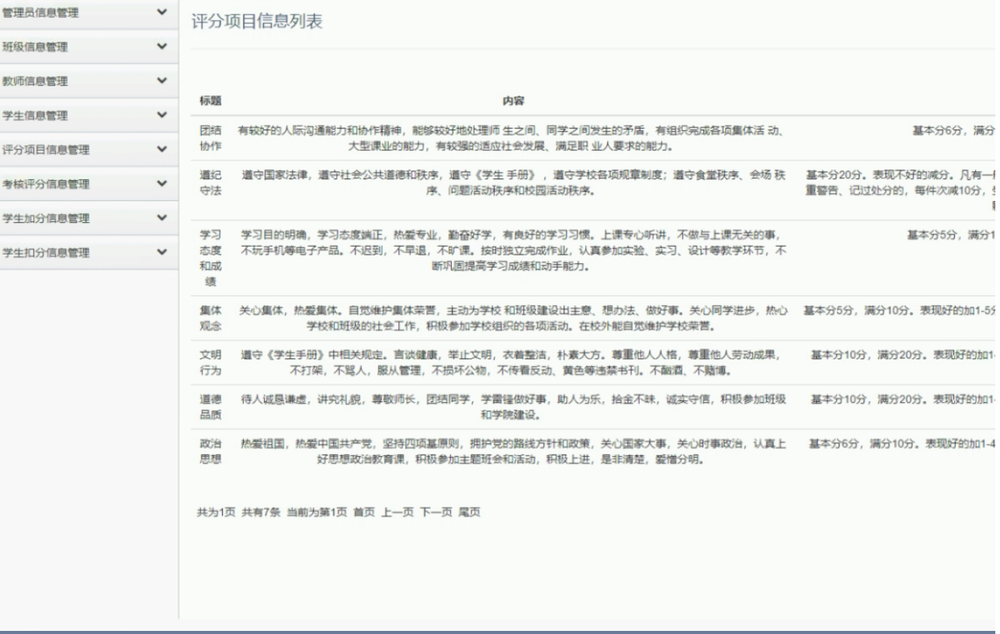

# 学生行为考核评分系统SSM

#### 介绍
学生行为考核评分系统(SSM,MySQL)

学生日常行为评分系统(SSM,MySQL )(毕业论文11089字以上,共26页,程序代码,MySQL数据库)

作者QQ- 1305637939

项目功能演示视频： https://www.ixigua.com/7063647894422684193?is_new_connect=0&is_new_user=0&wid_try=1
3664

【项目包含内容】

【项目功能介绍】

本系统提供了评分项目信息管理、考核评分信息管理、学生扣分管理、学生加分管理，再到系统管理的功能，方便及满足了学生日常行为评测人员的需求。

【文档包含内容】

【数据库截图】

【项目运行截图】   

